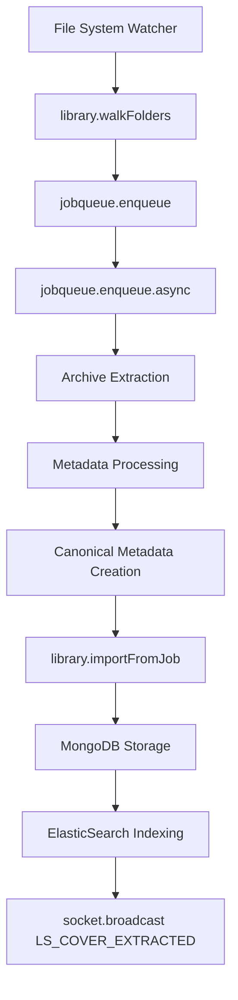
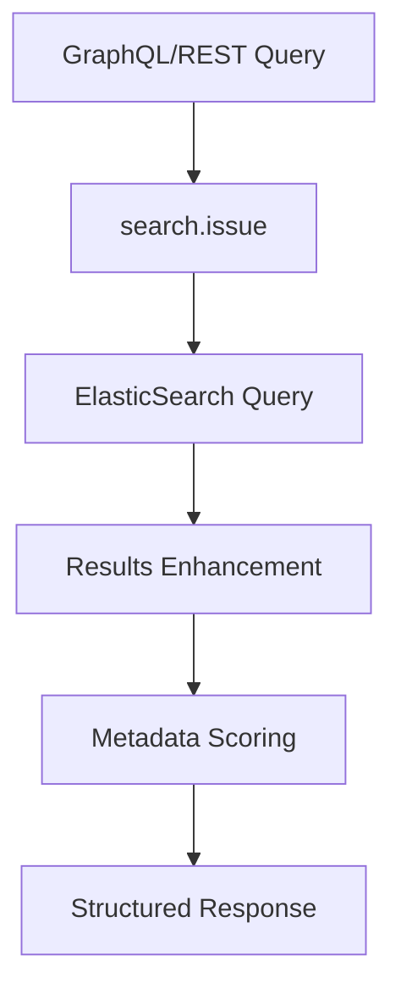

# Moleculer Microservices Dependency Analysis
**ThreeTwo Core Service - Comic Book Library Management System**

## System Overview

This **ThreeTwo Core Service** is a sophisticated **comic book library management system** built on Moleculer microservices architecture. The system demonstrates advanced patterns including:

- **Event-driven architecture** with real-time WebSocket communication
- **Asynchronous job processing** with BullMQ for heavy operations
- **Multi-source metadata aggregation** with canonical data resolution
- **Hybrid search** combining MongoDB aggregation and ElasticSearch
- **External system integrations** (P2P, BitTorrent, Comic APIs)

### Technical Stack

- **Framework**: Moleculer.js microservices
- **Node ID**: `threetwo-core-service`
- **Transport**: Redis (`redis://localhost:6379`)
- **Databases**: MongoDB + ElasticSearch
- **Queue System**: BullMQ (Redis-backed)
- **Real-time**: Socket.IO with Redis adapter
- **External APIs**: ComicVine, AirDC++, qBittorrent

## Service Architecture

### Core Services

| Service | File | Role | Dependencies |
|---------|------|------|-------------|
| **API** | [`api.service.ts`](services/api.service.ts) | API Gateway + File System Watcher | → library, jobqueue |
| **Library** | [`library.service.ts`](services/library.service.ts) | Core Comic Library Management | → jobqueue, search, comicvine |
| **JobQueue** | [`jobqueue.service.ts`](services/jobqueue.service.ts) | Asynchronous Job Processing (BullMQ) | → library, socket |
| **Socket** | [`socket.service.ts`](services/socket.service.ts) | Real-time Communication (Socket.IO) | → library, jobqueue |
| **Search** | [`search.service.ts`](services/search.service.ts) | ElasticSearch Integration | ElasticSearch client |
| **GraphQL** | [`graphql.service.ts`](services/graphql.service.ts) | GraphQL API Layer | → search |

### Supporting Services

| Service | File | Role | Dependencies |
|---------|------|------|-------------|
| **AirDC++** | [`airdcpp.service.ts`](services/airdcpp.service.ts) | P2P File Sharing Integration | External AirDC++ client |
| **Settings** | [`settings.service.ts`](services/settings.service.ts) | Configuration Management | MongoDB |
| **Image Transform** | [`imagetransformation.service.ts`](services/imagetransformation.service.ts) | Cover Processing | File system |
| **OPDS** | [`opds.service.ts`](services/opds.service.ts) | Comic Catalog Feeds | File system |
| **Torrent Jobs** | [`torrentjobs.service.ts`](services/torrentjobs.service.ts) | BitTorrent Integration | → library, qbittorrent |

## Service-to-Service Dependencies

### Core Service Interactions

#### 1. API Service → Other Services
```typescript
// File system watcher triggers import
ctx.broker.call("library.walkFolders", { basePathToWalk: filePath })
ctx.broker.call("importqueue.processImport", { fileObject })
```

#### 2. Library Service → Dependencies
```typescript
// Job queue integration
this.broker.call("jobqueue.enqueue", { action: "enqueue.async" })

// Search operations
ctx.broker.call("search.searchComic", { elasticSearchQueries })
ctx.broker.call("search.deleteElasticSearchIndices", {})

// External metadata
ctx.broker.call("comicvine.getVolumes", { volumeURI })
```

#### 3. JobQueue Service → Dependencies
```typescript
// Import processing
this.broker.call("library.importFromJob", { importType, payload })

// Real-time updates
this.broker.call("socket.broadcast", {
    namespace: "/",
    event: "LS_COVER_EXTRACTED",
    args: [{ completedJobCount, importResult }]
})
```

#### 4. Socket Service → Dependencies
```typescript
// Job management
ctx.broker.call("jobqueue.getJobCountsByType", {})
ctx.broker.call("jobqueue.toggle", { action: queueAction })

// Download tracking
ctx.call("library.applyAirDCPPDownloadMetadata", {
    bundleId, comicObjectId, name, size, type
})
```

#### 5. GraphQL Service → Search
```typescript
// Wanted comics query
const result = await ctx.broker.call("search.issue", {
    query: eSQuery,
    pagination: { size: limit, from: offset },
    type: "wanted"
})
```

## API Endpoint Mapping

### REST API Routes (`/api/*`)

#### Library Management
- `POST /api/library/walkFolders` → [`library.walkFolders`](services/library.service.ts:82)
- `POST /api/library/newImport` → [`library.newImport`](services/library.service.ts:165) → [`jobqueue.enqueue`](services/library.service.ts:219)
- `POST /api/library/getComicBooks` → [`library.getComicBooks`](services/library.service.ts:535)
- `POST /api/library/getComicBookById` → [`library.getComicBookById`](services/library.service.ts:550)
- `POST /api/library/flushDB` → [`library.flushDB`](services/library.service.ts:818) → [`search.deleteElasticSearchIndices`](services/library.service.ts:839)
- `GET /api/library/libraryStatistics` → [`library.libraryStatistics`](services/library.service.ts:684)

#### Job Management
- `GET /api/jobqueue/getJobCountsByType` → [`jobqueue.getJobCountsByType`](services/jobqueue.service.ts:31)
- `GET /api/jobqueue/toggle` → [`jobqueue.toggle`](services/jobqueue.service.ts:38)
- `GET /api/jobqueue/getJobResultStatistics` → [`jobqueue.getJobResultStatistics`](services/jobqueue.service.ts:214)

#### Search Operations
- `POST /api/search/searchComic` → [`search.searchComic`](services/search.service.ts:28)
- `POST /api/search/searchIssue` → [`search.issue`](services/search.service.ts:60)
- `GET /api/search/deleteElasticSearchIndices` → [`search.deleteElasticSearchIndices`](services/search.service.ts:171)

#### AirDC++ Integration
- `POST /api/airdcpp/initialize` → [`airdcpp.initialize`](services/airdcpp.service.ts:24)
- `POST /api/airdcpp/getHubs` → [`airdcpp.getHubs`](services/airdcpp.service.ts:59)
- `POST /api/airdcpp/search` → [`airdcpp.search`](services/airdcpp.service.ts:96)

#### Image Processing
- `POST /api/imagetransformation/resizeImage` → [`imagetransformation.resize`](services/imagetransformation.service.ts:37)
- `POST /api/imagetransformation/analyze` → [`imagetransformation.analyze`](services/imagetransformation.service.ts:57)

### GraphQL Endpoints
- `POST /graphql` → [`graphql.wantedComics`](services/graphql.service.ts:49) → [`search.issue`](services/graphql.service.ts:77)

### Static File Serving
- `/userdata/*` → Static files from `./userdata`
- `/comics/*` → Static files from `./comics`
- `/logs/*` → Static files from `logs`

## Event-Driven Communication

### Job Queue Events

#### Job Completion Events
```typescript
// Successful import completion
"enqueue.async.completed" → socket.broadcast("LS_COVER_EXTRACTED", {
    completedJobCount,
    importResult: job.returnvalue.data.importResult
})

// Failed import handling
"enqueue.async.failed" → socket.broadcast("LS_COVER_EXTRACTION_FAILED", {
    failedJobCount,
    importResult: job
})

// Queue drained
"drained" → socket.broadcast("LS_IMPORT_QUEUE_DRAINED", {
    message: "drained"
})
```

#### Archive Processing Events
```typescript
// Archive uncompression completed
"uncompressFullArchive.async.completed" → socket.broadcast("LS_UNCOMPRESSION_JOB_COMPLETE", {
    uncompressedArchive: job.returnvalue
})
```

### File System Events
```typescript
// File watcher events (debounced 200ms)
fileWatcher.on("add", (path, stats) → {
    broker.call("library.walkFolders", { basePathToWalk: filePath })
    broker.call("importqueue.processImport", { fileObject })
    broker.broadcast(event, { path: filePath })
})
```

### WebSocket Events

#### Real-time Search
```typescript
// Search initiation
socket.emit("searchInitiated", { instance })

// Live search results
socket.emit("searchResultAdded", groupedResult)
socket.emit("searchResultUpdated", updatedResult)
socket.emit("searchComplete", { message })
```

#### Download Progress
```typescript
// Download status
broker.emit("downloadCompleted", bundleDBImportResult)
broker.emit("downloadError", error.message)

// Progress tracking
socket.emit("downloadTick", data)
```

## Data Flow Architecture

### 1. Comic Import Processing Flow


### 2. Search & Discovery Flow


### 3. Download Management Flow
```mermaid
graph TD
    A[socket[search]] --> B[airdcpp.search]
    B --> C[Real-time Results]
    C --> D[socket[download]]
    D --> E[library.applyAirDCPPDownloadMetadata]
    E --> F[Progress Tracking]
    F --> G[Import Pipeline]
```

## Database Dependencies

### MongoDB Collections
| Collection | Model | Used By Services |
|------------|-------|-----------------|
| **comics** | [`Comic`](models/comic.model.ts) | library, search, jobqueue, imagetransformation |
| **settings** | [`Settings`](models/settings.model.ts) | settings |
| **sessions** | [`Session`](models/session.model.ts) | socket |
| **jobresults** | [`JobResult`](models/jobresult.model.ts) | jobqueue |

### ElasticSearch Integration
- **Index**: `comics` - Full-text search with metadata scoring
- **Client**: [`eSClient`](services/search.service.ts:13) from [`comic.model.ts`](models/comic.model.ts)
- **Query Types**: match_all, multi_match, bool queries with field boosting

### Redis Usage
| Purpose | Services | Configuration |
|---------|----------|---------------|
| **Transport** | All services | [`moleculer.config.ts:93`](moleculer.config.ts:93) |
| **Job Queue** | jobqueue | [`jobqueue.service.ts:27`](services/jobqueue.service.ts:27) |
| **Socket.IO Adapter** | socket | [`socket.service.ts:48`](services/socket.service.ts:48) |
| **Job Counters** | jobqueue | [`completedJobCount`](services/jobqueue.service.ts:392), [`failedJobCount`](services/jobqueue.service.ts:422) |

## External System Integrations

### AirDC++ (P2P File Sharing)
```typescript
// Integration wrapper
const ADCPPSocket = new AirDCPPSocket(config)
await ADCPPSocket.connect()

// Search operations
const searchInstance = await ADCPPSocket.post("search")
const searchInfo = await ADCPPSocket.post(`search/${searchInstance.id}/hub_search`, query)

// Download management
const downloadResult = await ADCPPSocket.post(`search/${searchInstanceId}/results/${resultId}/download`)
```

### ComicVine API
```typescript
// Metadata enrichment
const volumeDetails = await this.broker.call("comicvine.getVolumes", {
    volumeURI: matchedResult.volume.api_detail_url
})
```

### qBittorrent Client
```typescript
// Torrent monitoring
const torrents = await this.broker.call("qbittorrent.getTorrentRealTimeStats", { infoHashes })
```

## Metadata Management System

### Multi-Source Metadata Aggregation
The system implements sophisticated metadata management with source prioritization:

#### Source Priority Order
1. **ComicInfo.xml** (embedded in archives)
2. **ComicVine API** (external database)
3. **Metron** (comic database)
4. **Grand Comics Database (GCD)**
5. **League of Comic Geeks (LOCG)**
6. **Filename Inference** (fallback)

#### Canonical Metadata Structure
```typescript
const canonical = {
    title: findBestValue('title', inferredMetadata.title),
    series: {
        name: findSeriesValue(['series', 'seriesName', 'name'], inferredMetadata.series),
        volume: findBestValue('volume', inferredMetadata.volume || 1),
        startYear: findBestValue('startYear', inferredMetadata.issue?.year)
    },
    issueNumber: findBestValue('issueNumber', inferredMetadata.issue?.number),
    publisher: findBestValue('publisher', null),
    creators: [], // Combined from all sources
    completeness: {
        score: calculatedScore,
        missingFields: [],
        lastCalculated: currentTime
    }
}
```

## Performance & Scalability Insights

### Asynchronous Processing
- **Heavy Operations**: Comic import, archive extraction, metadata processing
- **Queue System**: BullMQ with Redis backing for reliability
- **Job Types**: Import processing, archive extraction, torrent monitoring
- **Real-time Updates**: WebSocket progress notifications

### Search Optimization
- **Dual Storage**: MongoDB (transactional) + ElasticSearch (search)
- **Metadata Scoring**: Canonical metadata with source priority
- **Query Types**: Full-text, field-specific, boolean combinations
- **Caching**: Moleculer built-in memory caching

### External Integration Resilience
- **Timeout Handling**: Custom timeouts for long-running operations
- **Error Propagation**: Structured error responses with context
- **Connection Management**: Reusable connections for external APIs
- **Retry Logic**: Built-in retry policies for failed operations

## Critical Dependency Patterns

### 1. Service Chain Dependencies
- **Import Pipeline**: api → library → jobqueue → socket
- **Search Pipeline**: graphql → search → ElasticSearch
- **Download Pipeline**: socket → airdcpp → library

### 2. Circular Dependencies (Managed)
- **socket ←→ library**: Download coordination and progress updates
- **jobqueue ←→ socket**: Job progress notifications and queue control

### 3. Shared Resource Dependencies
- **MongoDB**: library, search, jobqueue, settings services
- **Redis**: All services (transport) + jobqueue (BullMQ) + socket (adapter)
- **ElasticSearch**: search, graphql services

## Architecture Strengths

### 1. Separation of Concerns
- **API Gateway**: Pure routing and file serving
- **Business Logic**: Centralized in library service
- **Data Access**: Abstracted through DbMixin
- **External Integration**: Isolated in dedicated services

### 2. Event-Driven Design
- **File System Events**: Automatic import triggering
- **Job Lifecycle Events**: Progress tracking and error handling
- **Real-time Communication**: WebSocket event broadcasting

### 3. Robust Metadata Management
- **Multi-Source Aggregation**: ComicVine, ComicInfo.xml, filename inference
- **Canonical Resolution**: Smart metadata merging with source attribution
- **User Curation Support**: Framework for manual metadata override

### 4. Scalability Features
- **Microservices Architecture**: Independent service scaling
- **Asynchronous Processing**: Heavy operations don't block API responses
- **Redis Transport**: Distributed service communication
- **Job Queue**: Reliable background processing with retry logic

## Potential Areas for Improvement

### 1. Service Coupling
- **High Interdependence**: library ←→ jobqueue ←→ socket tight coupling
- **Recommendation**: Event-driven decoupling for some operations

### 2. Error Handling
- **Inconsistent Patterns**: Mix of raw errors and MoleculerError usage
- **Recommendation**: Standardized error handling middleware

### 3. Configuration Management
- **Environment Variables**: Direct access vs centralized configuration
- **Recommendation**: Enhanced settings service for runtime configuration

### 4. Testing Strategy
- **Integration Testing**: Complex service interactions need comprehensive testing
- **Recommendation**: Contract testing between services

## Summary

This Moleculer-based architecture demonstrates sophisticated microservices patterns with:

- **11 specialized services** with clear boundaries
- **47 REST endpoints** + GraphQL layer
- **3 WebSocket namespaces** for real-time communication
- **Multi-database architecture** (MongoDB + ElasticSearch)
- **Advanced job processing** with BullMQ
- **External system integration** (P2P, BitTorrent, Comic APIs)

The system successfully manages complex domain requirements while maintaining good separation of concerns and providing excellent user experience through real-time updates and comprehensive metadata management.